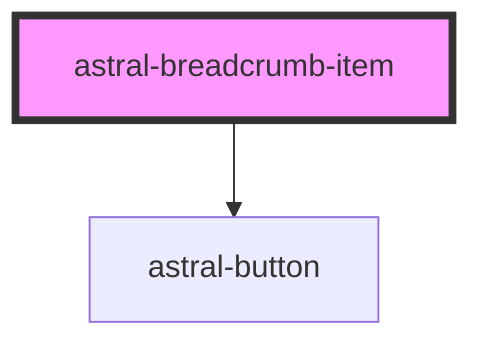

# astral-breadcrumb-item

<!-- Auto Generated Below -->

## Properties

| Property           | Attribute           | Description | Type                                                                  | Default     |
| ------------------ | ------------------- | ----------- | --------------------------------------------------------------------- | ----------- |
| `active`           | `active`            |             | `boolean`                                                             | `false`     |
| `color`            | `color`             |             | `"primary" \| "secondary" \| "success" \| "transparent" \| "warning"` | `undefined` |
| `disabled`         | `disabled`          |             | `boolean`                                                             | `false`     |
| `href`             | `href`              |             | `string`                                                              | `undefined` |
| `separatorContent` | `separator-content` |             | `string`                                                              | `''`        |

## Dependencies

### Depends on

- [astral-button](../../astral-button)

### Graph

----------------------------------------------

*Built with [StencilJS](https://stenciljs.com/)*
