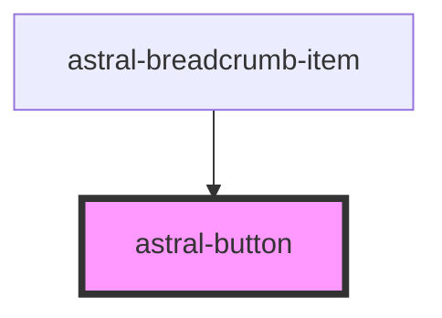

# astral-button

<!-- Auto Generated Below -->

## Properties

| Property      | Attribute     | Description | Type                                                                  | Default         |
| ------------- | ------------- | ----------- | --------------------------------------------------------------------- | --------------- |
| `color`       | `color`       |             | `"primary" \| "secondary" \| "success" \| "transparent" \| "warning"` | `'transparent'` |
| `disabled`    | `disabled`    |             | `boolean`                                                             | `false`         |
| `extendedfab` | `extendedfab` |             | `boolean`                                                             | `false`         |
| `fab`         | `fab`         |             | `boolean`                                                             | `false`         |
| `icon`        | `icon`        |             | `boolean`                                                             | `false`         |
| `raised`      | `raised`      |             | `boolean`                                                             | `false`         |
| `stroked`     | `stroked`     |             | `boolean`                                                             | `false`         |

## Dependencies

### Used by

 - [astral-breadcrumb-item](../astral-breadcrumb/astral-breadcrumb-item)

### Graph

----------------------------------------------

*Built with [StencilJS](https://stenciljs.com/)*
